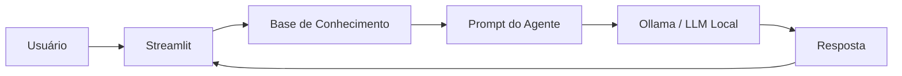

# DataGuide — Assistente Inteligente para Dados

Projeto desenvolvido para o desafio **"Construa Seu Assistente Virtual Com Inteligência Artificial"** da DIO.

O DataGuide é um assistente virtual educacional criado para ajudar pessoas iniciantes e intermediárias a entender conceitos de **Análise de Dados, Excel, Power BI, indicadores e automação**.

> **Importante:** o projeto é um protótipo educacional. Ele não substitui documentação oficial, cursos ou orientação profissional.

## Objetivo

Criar um agente de IA capaz de:

- responder dúvidas sobre dados e BI;
- explicar conceitos de forma simples;
- utilizar uma base de conhecimento própria;
- apresentar exemplos práticos;
- evitar inventar informações fora da base;
- indicar quando não possui informação suficiente.

## Tecnologias

- Python
- Streamlit
- Pandas
- Requests
- Ollama
- Markdown / JSON / CSV
- Git e GitHub

## Arquitetura



## Estrutura

```text
assistente-virtual-ia/
├── README.md
├── requirements.txt
├── .gitignore
├── data/
│   ├── base_conhecimento.json
│   ├── indicadores.csv
│   └── exemplos_perguntas.csv
├── docs/
│   ├── 01-documentacao-agente.md
│   ├── 02-base-conhecimento.md
│   ├── 03-prompts.md
│   ├── 04-metricas.md
│   └── 05-pitch.md
├── src/
│   ├── app.py
│   └── knowledge.py
└── assets/
    └── .gitkeep
```

## Como executar no VS Code

### 1. Pré-requisitos

Tenha instalado:

- Python 3.10 ou superior
- VS Code
- Ollama

### 2. Criar e ativar ambiente virtual

No terminal do VS Code:

**Windows PowerShell:**

```powershell
python -m venv .venv
.\.venv\Scripts\Activate.ps1
```

Se o PowerShell bloquear a ativação, use o terminal CMD:

```cmd
.venv\Scripts\activate
```

### 3. Instalar dependências

```bash
pip install -r requirements.txt
```

### 4. Preparar o Ollama

Instale o Ollama e baixe um modelo.

Exemplo:

```bash
ollama pull gpt-oss
```

Depois, se necessário:

```bash
ollama serve
```

O aplicativo utiliza por padrão:

```text
http://localhost:11434
```

e o modelo:

```text
gpt-oss
```

Esses valores podem ser alterados pela barra lateral da aplicação.

### 5. Executar

```bash
streamlit run src/app.py
```

O navegador abrirá a interface do DataGuide.

## Modo de demonstração

Caso o Ollama não esteja disponível, a aplicação possui um **modo demonstração** com respostas pré-configuradas para alguns exemplos.

Isso permite testar a interface mesmo antes de instalar/configurar o modelo local.

Quando o Ollama estiver disponível, o agente passa a utilizar a LLM local.

## Segurança e anti-alucinação

O agente recebe no prompt:

1. objetivo;
2. regras de comportamento;
3. limitações;
4. conteúdo da base de conhecimento;
5. instrução para não inventar informações;
6. orientação para declarar ausência de informação quando necessário.

A aplicação também mantém a base de conhecimento separada do código.

## Avaliação

Os testes definidos no projeto avaliam:

- assertividade;
- aderência à base;
- segurança contra informações não presentes;
- clareza;
- coerência.

Os casos de teste estão documentados em:

`docs/04-metricas.md`

## Etapas do desafio

| Etapa | Implementação |
|---|---|
| 1. Documentação | `docs/01-documentacao-agente.md` |
| 2. Base de conhecimento | `data/` + `docs/02-base-conhecimento.md` |
| 3. Prompts | `docs/03-prompts.md` |
| 4. Aplicação funcional | `src/app.py` |
| 5. Avaliação e métricas | `docs/04-metricas.md` |
| 6. Pitch | `docs/05-pitch.md` |

## Autor

**Vinícius Rodrigues Rocha**

Projeto educacional desenvolvido para portfólio e conclusão do desafio da DIO.
